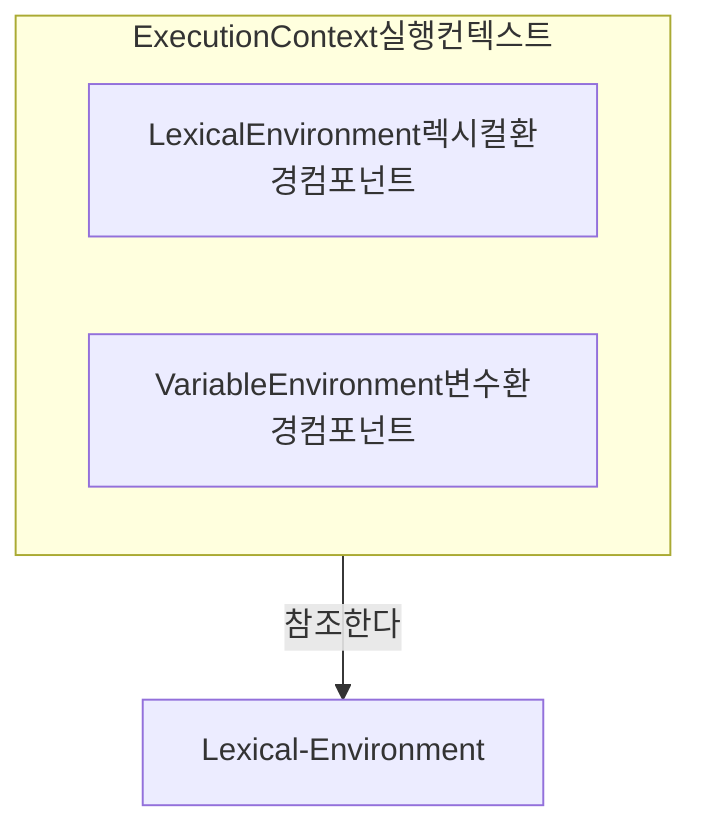
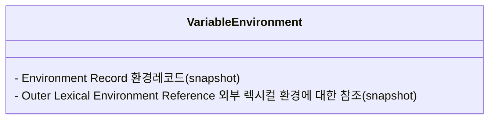
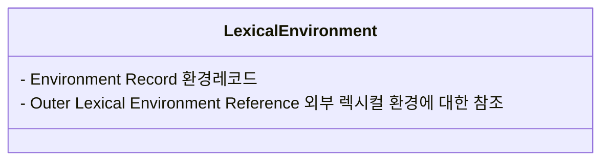
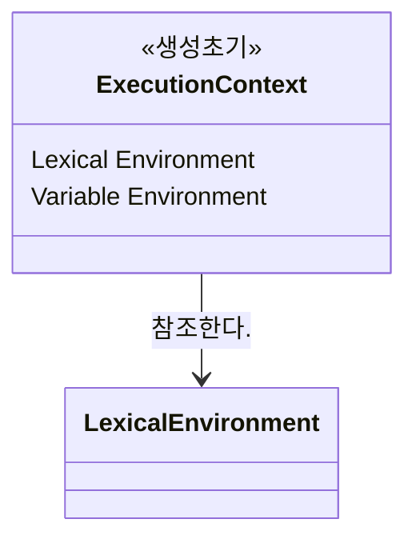

# 실행 컨텍스트
- 실행할 코드에 제공할 환경 정보들을 모아놓은 객체, 실행 가능한 코드가 실행되기 위해 필요한 환경 
- 함수가 실행되는 영역 
- 식별자를 등록하고 관리하는 스코프와 코드 실행 순서 관리를 구현한 내부 메커니즘으로, 모든 코드는 실행 컨텍스트를 통해 실행되고 관리된다. 
<<<<<<< HEAD
- 식별자와 스코프는 실행 컨텍스트의 렉시컬 환경으로 관리하고 코드 실행 순서는 __실행 컨텍스트 스택__ 으로 관리한다. 
- 실행 컨텍스트 스택을 __콜 스택__ 이라고 부르기도 한다.
=======
- 식별자와 스코프는 실행 컨텍스트의 렉시컬 환경으로 관리하고 코드 실행 순서는 실행 컨텍스트 스택으로 관리한다. 
>>>>>>> 4966a4a192cd35f016d33ded90a6e0476443ba6e

## 4가지 타입의 소스코드(ECMA Script 사양은 4가지 타입으로 구분한다.) 이 소스코드는 실행 컨텍스트를 생성한다.

>__소스코드를 4가지 타입으로 나누는 이유는?__  
 소스코드의 타입에 따라 실행 컨텍스트를 생성하는 과정과 관리 내용이 다르기 때문

1. 전역 코드 global code
	- 전역 영역에 존재하는 소스코드. 전역에 정의된 함수, 클래스 등의 내부 코드는 포함되지 않는다.
	- 전역 코드가 평가되면 전역 실행 컨텍스트가 생성된다.
2. 함수 코드 function code
	- 함수 내부에 존재하는 소스코드. 함수 내부에 중첩된 함수, 클래스 등의 내부 코드는 포함되지 않는다. 
	- 함수 코드는 지역 스코프를 생성하고 지역 변수, 매개변수, arguments 객체를 관리해야 한다. 그리고 생성한 지역 스코프를 전역 스코프에서 시작하는 스코프 체인의 일원으로 연결해야 한다. 
3. eval 코드 eval code
	- 빌트인 전역 함수인 eval 함수에 인수로 전달되어 실행되는 소스코드.
4. 모듈 코드 module code
	- 모듈 내부에 존재하는 소스코드. 모듈 내부의 함수, 클래스 등의 내부 코드는 포함되지 않는다.

## 실행 컨텍스트의 구성 


<<<<<<< HEAD


생성 초기에는 하나의 동일한 Lexical 환경을 참조한다.


## 1. 변수 환경 Variable Environment


현재 컨텍스트 내의 식별자들에 대한 정보 + 외부 환경 정보, 선언 시점의 Lexical Environment의 스냅샷으로, 변경 사항은 반영되지 않음
  - 실행 컨텍스트를 생성할 때 Variable Environment에 정보를 먼저 담은 다음, 이를 그대로 복사해서 Lexical Environment를 만들고, 이후에는 Lexical Environment를 주로 활용하게 됨
  - 초기화 과정 중에는 Lexical Environment와 사실상 완전히 __동일__ 하고 이후 코드 진행에 따라 서로 달라지게 됨

## 2. 렉시컬 환경 Lexical Environment


- 처음에는 VariableEnvironment와 같지만 변경 사항이 __실시간으로 반영됨__
- 식별자와 식별자에 바인딩된 값, 상위 스코프에 대한 참조를 기록하는 자료구조로 실행 컨텍스트를 구성하는 컴포넌트다.  
실행 컨텍스트 스택이 실행 순서를 관리한다면 렉시컬 환경은 __스코프와 식별자__ 를 관리한다. 


```js
// <Global>
const x = 1;
function foo() {
  const y = 2;
}
```

|Global Lexical Environment   |   |
|---|---|
|x   | 1  |
|foo   | <xmp><function object></xmp>  |

⬇ 스코프 체인

|foo Lexical Environment   |   |
|---|---|
|y   | 2  |
- 함수 초기화 단계에서 해석한 함수와 변수를 `{name: value}` 형태로 저장
- 렉시컬 환경은 키와 값을 같는 객체 형태의 스코프를 생성하여 식별자를 키로 등록하고 식별자에 바인딩된 값을 관리한다. 즉 렉시컬 환경은 스코프를 구분하여 식별자를 등록하고 관리하는 저장소 역할을 하는 렉시컬 스코프의 실체다. 
- 자바스크립트 코드에서 변수나 함수 등의 식별자를 정의하는 데 사용하는 객체로 생각하면 쉬움
- 정적 환경, 사전적 환경.. : 컨텍스트를 구성하는 환경 정보들을 사전에서 접하는 느낌으로 모아놓은 것

- 이름으로 함수와 변수를 검색할 수 있게 됨 
- 함수 밖의 함수와 변수를 참조 할 수 있는 환경을 설정함 
  - 함수 밖의 함수와 변수를 사용할 수 있게 됨 (함수 안에 있는 것과 밖에 있는 것을 하나의 묶음으로 렉시컬 환경 컴포넌트에 만드는 것)

<렉시컬 환경 컴포넌트 구성>
=======


생성 초기에는 하나의 동일한 Lexical 환경을 참조한다. 


## 렉시컬 환경 Lexical Environment 

: 식별자와 식별자에 바인딩된 값, 상위 스코프에 대한 참조를 기록하는 자료구조로 실행 컨텍스트를 구성하는 컴포넌트다.  
실행 컨텍스트 스택이 실행 순서를 관리한다면 렉시컬 환경은 스코프와 식별자를 관리한다. 

- 렉시컬 환경은 키와 값을 같는 객체 형태의 스코프를 생성하여 식별자를 키로 등록하고 식별자에 바인딩된 값을 관리한다. 즉 렉시컬 환경은 스코프를 구분하여 식별자를 등록하고 관리하는 저장소 역할을 하는 렉시컬 스코프의 실체다. 


<실행 컨텍스트 상태 컴포넌트> : 실행 컨텍스트 객체에 담기는 정보
1. VariableEnvironment 변수 환경 컴포넌트 (VEC)
  - environmentRecord (snapshot)
  - outerEnvironmentReference (snapshot)
  - 현재 컨텍스트 내의 식별자들에 대한 정보 + 외부 환경 정보, 선언 시점의 LexicalEnvironment의 스냅샷으로, 변경 사항은 반영되지 않음
    <br><br>
  - 실행 컨텍스트를 생성할 때 VariableEnvironment에 정보를 먼저 담은 다음, 이를 그대로 복사해서 LexicalEnvironment를 만들고, 이후에는 LexicalEnvironment를 주로 활용하게 됨
  - 초기화 과정 중에는 LexicalEnvironment와 사실상 완전히 동일하고 이후 코드 진행에 따라 서로 달라지게 됨

## <변수 환경 컴포넌트>
- 실행 콘텍스트 초기화 단계에서 (변수, 함수 설정) 렉시컬 환경 컴포넌트와 같게 설정  왜냐?-> 초깃값을 복원할 때 사용하기 위한 것  
- 함수 코드가 실행되면 실행 결과를 렉시컬 환경 컴포넌트에 설정한다. 초깃값이 변하게 되므로 이를 유지하기 위해서 렉시컬 환경에 설정하는 것
- with문에서 사용한다. 


2. LexicalEnvironment 렉시컬 환경 컴포넌트 (LEC) : 함수 코드를 처리하기 위한 부분
  - environmentRecord
  - outerEnvironmentReference
  - 처음에는 VariableEnvironment와 같지만 변경 사항이 __실시간으로 반영됨__
    <br><br>
  - 자바스크립트 코드에서 변수나 함수 등의 식별자를 정의하는 데 사용하는 객체로 생각하면 쉬움
    정적 환경, 사전적 환경.. : 컨텍스트를 구성하는 환경 정보들을 사전에서 접하는 느낌으로 모아놓은 것 


  - 함수와 변수의 식별자 해결을 위한 환경 설정  
  - 함수 초기화 단계에서 해석한 함수와 변수를 {name: value} 형태로 저장
  - 이름으로 함수와 변수를 검색할 수 있게 됨 
  - 함수 밖의 함수와 변수를 참조 할 수 있는 환경을 설정함 
    - 함수 밖의 함수와 변수를 사용할 수 있게 됨 (함수 안에 있는 것과 밖에 있는 것을 하나의 묶음으로 렉시컬 환경 컴포넌트에 만드는 것)

  ## <렉시컬 환경 컴포넌트 구성>
>>>>>>> 4966a4a192cd35f016d33ded90a6e0476443ba6e
  ```js
  실행 콘텍스트(EC): {
    렉시컬 환경 컴포넌트(LEC): { //function, with, try-catch를 만났을 때 생성
      환경 레코드(ER): {
<<<<<<< HEAD
        변수명: value //변수
=======
        point: 100 //변수
>>>>>>> 4966a4a192cd35f016d33ded90a6e0476443ba6e
      },
      외부 렉시컬 환경 참조(OLER): {
        title: "책",
        getTitle: function(){} //함수
      }
    }
  }
<<<<<<< HEAD
  ```

### Environment Record 환경레코드와 호이스팅

- 스코프에 포함된 식별자를 등록하고 등록된 식별자에 바인딩된 값을 관리하는 저장소다. 
- 컨텍스트를 구성하는 함수에 지정된 매개변수 식별자, 선언한 함수가 있을 경우 그 함수 자체, var로 선언된 변수의 식별자 등이 식별자에 해당됨.
- 변수 정보를 수집하는 과정을 모두 마쳤더라도 아직 실행 컨텍스트가 관여할 코드들은 실행되기 전의 상태. : 코드가 실행되기 전임에도 불구하고 자바스크립트 엔진은 이미 해당 환경에 속한 코드의 변수명들을 모두 알고 있게 되는 셈. __호이스팅__ (가상의 개념)
- environmentRecord는 현재 실행될 컨텍스트의 대상 코드 내에 어떤 식별자들이 있는지에만 관심이 있고, 각 식별자에 어떤 값이 할당될 것인지는 관심이 없다. 따라서 변수를 호이스팅할 때 변수명만 끌어올리고 할당 과정은 원래 자리에 그대로 남겨둔다.

1. 선언적 함수 레코드 Declarative Environment Record
  - function, 변수(let, const), catch 문에서 사용
2. 오브젝트 함수 레코드 Object Environment Record
  - 글로벌 함수와 변수, with 문에서 사용
  - 동적(with문은 with문을 반복할 때 마다 스코프를 만든다.)

### Outer Environment Reference 외부 렉시컬 환경에 대한 참조 - (스코프, 스코프 체인)
- 상위 스코프를 가리킨다. 상위 스코프란? 외부 렉시컬 환경, 즉 해당 실행 컨텍스트를 생성한 소스코드를 포함하는 상위 코드의 렉시컬 환경을 말한다.
- 스코프란 식별자에 대한 유효범위 (ES5까지의 JS는 let, const가 없었기 때문에 오직 함수에 의해서만 스코프가 생성되었다. ES6에서는 블록에 의해서도 스코프 경계가 발생하게 함으로써 다른 언어와 훨씬 비슷해졌다. (let, const에만 적용됨) ES6에서는 둘을 구분하기 위해 함수 스코프, 블록 스코프라는 용어를 사용함)
- 외부 렉시컬 환경에 대한 참조를 통해 단방향 링크드 리스트인 스코프 체인을 구현한다.
- 스코프 체인 : 식별자의 유효범위를 안에서부터 바깥으로 차례로 검색해나가는 것. 이를 가능케 하는 것 : __outerEnvironmentReference__


<정리>  
  - outerEnvironmentReference는 현재 호출된 함수가 __선언될__ 당시의 LexicalEnvironment를 참조하면서 스코프 체인을 구현한다.


3. ThisBinding this 바인딩 컴포넌트 (TBC) : 변수안에서 this가 참조하는 오브젝트
  - 식별자가 바라봐야 할 대상 객체


## 실행 컨텍스트의 생성과 식별자 검색 과정

1. 전역 객체 생성 
- 전역 객체는 전역 코드가 평가되기 이전에 생성된다. 
2. 전역 코드 평가 
- 소스 코드가 로드되면 자바스크립트 엔진은 전역 코드를 평가한다. 

  1. 전역 실행 컨텍스트 생성 
  - 비어있는 전역 실행 컨텍스트를 생성하여 실행 컨텍스트 스택에 푸시한다. 
  2. 전역 렉시컬 환경 생성
  - 전역 렉시컬 환경을 생성하고 전역 실행 컨텍스트에 바인딩한다. 
  2-1. 전역 환경 레코드 생성
  - 전역 렉시컬 환경을 구성하는 컴포넌트인 전역 환경 레코드는 전역 변수를 관리하는 전역 스코프, 전역 객체의 빌트인 전역 프로퍼티와 빌트인 전역 함수, 표준 빌트인 객체를 제공한다. 
  - var, ES6 - let, const 키워드로 선언한 전역 변수를 구분하여 관리하기 위해 전역 스코프 역할을 하는 전역 환경 레코드는 객체 환경 레코드(Object Environment Record)와 선언적 환경 레코드(Declarative Environment Record)로 구성되어 있다. 
  2-2. this 바인딩
  - 전역 환경 레코드의 [[GlobalThisValue]] 내부 슬롯에 this가 바인딩된다. 
  - 전역 환경 레코드를 구성하는 객체 환경 레코드와 선언적 환경 레코드에는 this 바인딩이 없다. this 바인딩은 전역 환경 레코드와 함수 환경 레코드에만 존재한다. 
  2-3. 외부 렉시컬 환경에 대한 참조 결정 
  - 외부 렉시컬 환경에 대한 참조는 현재 평가 중인 소스코드를 포함하는 외부 소스코드의 렉시컬 환경, 즉 상위 스코프를 가리킨다. 이를 통해 단방향 링크드 리스트인 스코프 체인을 구현한다. 전역 코드를 포함하는 소스코드는 없으므로 전역 렉시컬 환경의 외부 렉시컬 환경에 대한 참조에 null이 해당된다. 이는 전역 렉시컬 환경이 스코프 체인의 종점에 존재함을 의미한다. 
  3. 전역 코드 실행 
  - 전역 코드가 순차적으로 실행되기 시작한다. 
=======

<렉시컬 환경 컴포넌트 설정>
- 환경 레코드에 함수 안의 함수와 변수를 기록 
- 외부 렉시컬 환경 참조에 function 오브젝트의 [[Scope]]를 설정
- 코드를 보면 LEC는 __묶음__ 즉 객체다. 
- 따라서 함수 안과 밖의 함수와 변수를 사용할 수 있게 됨

<외부 렉시컬 환경 참조>

- 스코프와 실행중인 함수가 Context 형태이므로 스코프의 변수와 함수를 별도의 처리 없이 즉시 사용할 수 있다.
- 실행 콘텍스트에서 함수 안과 밖의 함수, 변수를 사용할 수 있으므로 함수와 변수를 찾기 위해 실행 콘텍스트를 벗어 나지 않아도 된다. 

3. ThisBinding this 바인딩 컴포넌트 (TBC) : 변수안에서 this가 참조하는 오브젝트
  - 식별자가 바라봐야 할 대상 객체
>>>>>>> 4966a4a192cd35f016d33ded90a6e0476443ba6e
