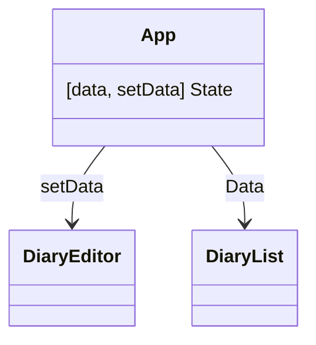

## 한입 크기 리액트 강의


## API
손님 요리사 냉장고
클라이언트 서버 데이터베이스 

json placeholder 
무료로 api - 더미데이터를 응답해줌
fetch : api를 호출할 수 있도록 도와주는 내장함수 , 프로미스를 반환한다.
api 결과값을 그냥 반환하는 게 아니라 api 성공 객체 자체를 반환한다.

```js
async function getData() {
  let rawResponse = await fetch("https://jsonplaceholder.typicode.com/posts");
  let jsonResponse = await rawResponse.json();
  console.log(jsonResponse);
}

getData();
```

## Node.js
자바스크립트를 브라우저가 아닌 곳에서도 실행시킬 수 있도록 만든 것
자바스크립트이 실행환경이라고도 부른다.
웹서버도 만들 수 있게 되었다.
url : 웹서버의 주소

## 모듈 export하고 불러오기
```js
const add = (a, b) => a + b;
const sub = (a, b) => a - b;

module.exports = {
  moduleName: "calc module",
  add: add,
  sub: sub,
};
```

```js
const calc = require("./calc");

console.log(calc.add(1, 2));
console.log(calc.add(1, 2));
console.log(calc.sub(1, 2));
```

npm : Node Package Manager
- Node.js의 패키지 관리 도구
- 누군가 따로 만들어놓은 node.js 모듈을 의미

## 리액트가 필요한 이유
- 중복 코드 
- 컴포넌트 기반의 UI 라이브러리 - "재사용"
- Virtual DOM : 가상의 돔 사용

웸팩 : 모듈 번들러 다수의 파일을 하나의 파일로 합쳐주는
보일러 플레이트 : 이미 세팅 완료된 패키지
npx

## JSX
- 닫힘 태그가 필요
- 최상위 태그 규칙 -> 반드시 하나의 부모를 가져야한다. fragment 쓸 수 있다.(import React 필요) `<React.Fragment>` 또는 `<></>`
- class -> className

```js

function App() {
  let name = "alex";

  const style = {
    App: {
      backgroundColor: "black",
    },
    h2: {
      color: "red",
    },
    b: {
      color: "green",
    },
  }

  return (
    <div style={style.App}>
      <MyHeader />
      <h2 style={style.h2}>안녕 리액트 {name}</h2>
      <b style={style.b}>React.js</b>
    </div>
  );
}
```
객체로 스타일을 줄 수도 있다.

jsx의 중괄호안에는 배열, boolean은 표시가 안됨. 숫자나 문자열, 식만 포함할 수 있다.

```js
  const number = 5;

  return (
    <div style={style.App}>
      <MyHeader />
      <h2 style={style.h2}>안녕 리액트 {name}</h2>
      <b style={style.b}>
        {number}는 : {number % 2 === 0 ? "짝수" : "홀수"}
      </b>
    </div>
  );
```
삼항 연산자도 사용 가능 (조건부 렌더링이라고 함)

## 상태 State
계속해서 변화하는 특정 상태
상태에 따라 각각 다른 동작을 함

컴포넌트가 가진 state가 바뀌면 재렌더를 한다. (리렌더)

```js
const Counter = () => {

  const [count, setCount] = useState(0);
  const onIncrease = () => {
    setCount(count + 1);
  }
  const onDecrease = () => {
    setCount(count - 1);
  }
  return (
    <div>
      <h2>{count}</h2>
      <button onClick={onIncrease}>+</button>
      <button onClick={onDecrease}>-</button>
    </div>
  )
}
```

## props
```js
function App() {
  const number = 5;

  const counterProps = {
    a: 1,
    b: 2,
    c: 3,
    d: 4,
    e: 5,
    initialValue: 5,
  }

  return (
    <div>
      <MyHeader />
      <Counter initialValue={5} />
      <Counter {...counterProps} />
    </div>
  );
}
```
`initialValue={5}` 이런식으로 넣어도 되고 객체안에 추가해서 넣어도 되고

```js
import React, {useState} from "react";


const Counter = (props) => {
  console.log(props)

  const [count, setCount] = useState(0);
  const onIncrease = () => {
    setCount(count + 1);
  }
  const onDecrease = () => {
    setCount(count - 1);
  }
  return (
    <div>
      <h2>{count}</h2>
      <button onClick={onIncrease}>+</button>
      <button onClick={onDecrease}>-</button>
    </div>
  )
}
```
전달 받을 땐 저렇게 한번에 가져와도 되고, const Counter = ({ initialValue }) 이렇게 들고와도 됨
defaultProps로 기본값 설정할 수 있음  
props는 정적인 데이터 뿐 아니라 동적인 데이터도 전달할 수 있음


### 컴포넌트 자체도 전달할 수 있다
```js
const Container = ({ children }) => {
  return (
    <div style={{ margin: 20, padding: 20, border: "1px solid gray" }}>
      {children}
    </div>
  );
}

export default Container;
```

```js
function App() {
  const number = 5;

  const counterProps = {
    a: 1,
    b: 2,
    c: 3,
    d: 4,
    e: 5,
    initialValue: 5,
  }

  return (
    <Container>
      <div>
        <MyHeader />
        <Counter {...counterProps} />
      </div>
    </Container>
  );
}
```
이렇게 되면 Container의 `children`은 App()의 Container 사이의 것들이 된다.


```js
import { useState } from "react";

const DiaryEditor = () => {

  const [state, setState] = useState({
    author: "",
    content: "",
  });

  return (
    <div className="DiaryEditor">
      <h2>오늘의 일기 AUTHOR</h2>
      <div>
        <input
          value={state.author}
          onChange={(e) => {
            setState({
              author: e.target.value,
              content: state.content,
            });
          }}
        />
      </div>
      <div>
        <textarea
          value={state.content}
          onChange={(e) => {
            setState({
              author: state.author,
              content: e.target.value,
            });
          }}
        />
      </div>
    </div>
  )
}

export default DiaryEditor;
```
- input과 textarea는 거의 같다. 그래서 state를 객체로 저렇게 묶어줄 수 있다.
- setState를 쓸 때 새로운 객체를 만들어서 author를 바꿀 땐 content는 바뀌면 안되니 저렇게 써준다. 반대로 content 바꿀 때는 author는 안바뀌게

```js
setState({
  ...state,
  author: e.target.value,
});
```
- __spread 문법__ 을 사용할 수도 있다.
- 순서를 바꾸면 동작하지 않음

```js

  const handleChangeState = (e) => {
    setState({
      ...state,
      [e.target.name]: e.target.value,
    });
  };

  return (
    <div className="DiaryEditor">
      <h2>오늘의 일기 AUTHOR</h2>
      <div>
        <input
          name="author"
          value={state.author}
          onChange={handleChangeState}
        />
      </div>
      <div>
        <textarea
          name="content"
          value={state.content}
          onChange={handleChangeState}
        />
      </div>
    </div>
  )
```
- onChange 이벤트가 중복으로 나열되어 있으니 handleChangeState를 따로 만들어 넣어주기

```js
const DiaryEditor = () => {

  const [state, setState] = useState({
    author: "",
    content: "",
    emotion: 1,
  });

  const handleChangeState = (e) => {
    setState({
      ...state,
      [e.target.name]: e.target.value,
    });
  };

  return (
    <div className="DiaryEditor">
      <h2>오늘의 일기 AUTHOR</h2>
      <div>
        <input
          name="author"
          value={state.author}
          onChange={handleChangeState}
        />
      </div>
      <div>
        <textarea
          name="content"
          value={state.content}
          onChange={handleChangeState}
        />
      </div>

      <div>
        <select
          name="emotion"
          value={state.emotion}
          onChange={handleChangeState}
        >
          <option value={1}>1</option>
          <option value={2}>2</option>
          <option value={3}>3</option>
          <option value={4}>4</option>
          <option value={5}>5</option>
        </select>
      </div>
    </div>
  )
}
```
select 탭도 똑같이 value, onChange 추가해주기


### dom 요소 선택해서 focus 주기
`useRef`

`	const authorInput = useRef();` 
```js
  <input
    ref={authorInput}
    name="author"
    value={state.author}
    onChange={handleChangeState}
  />
```
- input에 ref로 authorInput을 넣으면 authorInput으로 input에 접근할 수 있게됨

```js
  const handleSubmit = () => {
    if (state.author.length < 1) {
      authorInput.current.focus();
      return;
    }
```
- `authorInput.current.focus()`  
- useRef로 생성한 authorInput은 현재 가리키는 값을 `current` 라는 값으로 불러와서 사용할 수 있다.

## defaultProps
props의 기본값을 설정할 수 있다.
```js
DiaryList.defaultProps = {
  diaryList:[],
}
```

## map 사용
```js
import './App.css';
import DiaryEditor from './DiaryEditor';
import DiaryList from './DiaryList';

const dummyList = [
  {
    id: 1,
    author: "이정환",
    content: "하이1",
    emotion: 1,
    created_date: new Date().getTime()
  },
  {
    id: 2,
    author: "이정",
    content: "하이2",
    emotion: 2,
    created_date: new Date().getTime()
  },
  {
    id: 3,
    author: "이환",
    content: "하이3",
    emotion: 3,
    created_date: new Date().getTime()
  },
]

function App() {
  return (
    <div className="App">
      <DiaryEditor/>
      <DiaryList diaryList={dummyList} />
    </div>
  );
}

export default App;
```

```js
const DiaryList = ({diaryList}) => {

  return (
    <div className="DiaryList">
      <h2>일기 리스트</h2>
      <h4>{diaryList.length}개의 일기가 있스빈다.</h4>
      <div>
        {diaryList.map((it) => (
          <div>
            <div>작성자 : {it.author}</div>
            <div>일기 : {it.content}</div>
            <div>감정 : {it.emotion}</div>
            <div>작성 시간 : {it.created_date}</div>
          </div>
        ))}
      </div>
    </div>
  );
};

DiaryList.defaultProps = {
  diaryList:[],
}

export default DiaryList;
```

### key
map 배열의 인덱스를 key로 사용할 수 있지만 삭제 등의 이유로 순서가 바껴버리면 문제가 생길 수 있다.

### diary list 만들기
```js
  <div>
    {diaryList.map((it) => (
      <DiaryItem key={it.id} {...it} />
    ))}
  </div>
```
diarylist를 수정, 삭제 기능도 넣어야하기 때문에 DiaryItem를 따로 만들고 위위 코드의 map부분을 저렇게 바꿔주기
prop으로 {...it} it을 다 넘겨준다.

```js
const DiaryItem = ({author, content, created_date, emotion, id}) => {
  return (
    <div className="DiaryItem">
    <div className="info">
      <span>
        작성자 : {author} | 감정점수 : {emotion}
      </span>
      <br />
      <span className="date">
        {new Date(created_date).toLocaleString()}
      </span>
    </div>
    <div className="content">{content}</div>

    </div>
  )
}

export default DiaryItem;
```

## 컴포넌트 트리


- 부모와 자식들이 얽힌 계층구조
- 같은 레벨간에는 정보를 주고받기가 불가능하다.
- React는 단방향으로만 데이터가 흐른다.

- DiaryEditor, DiaryList의 공통부모인 App 컴포넌트가 일기 데이터를 state로 가지고 있고 각각 리스트에는 Data를 editor에는 setData를 props로 전달해주면 된다.

- 리액트에서 추가, 수정, 삭제같은 __EVENT__ 는 아래에서 위로 올라가는 구조일 수 있다. -> DiaryEditor에서 "추가"라는 이벤트가 발생하게 되면 setData를 변화시키면서 data가 변경된다.

```js
function App() {
  const [data, setDate] = useState([]);

  const dataId = useRef(0);

  const onCreate = (author, content, emotion) => {
    const create_date = new Date().getTime();
    const newItem = {
      author,
      content,
      emotion,
      create_date,
      id : dataId.current,
    }
    dataId.current += 1;
    setDate([newItem, ...data]);
  }

  return (
    <div className="App">
      <DiaryEditor onCreate={onCreate} />
      <DiaryList diaryList={data} />
    </div>
  );
}

```
dummylist를 지우고 App에 data를 관리하는 useState를 만들어준다.
DiaryList에는 data만 전달하고 DiaryEditor에는 data를 추가할 수 있는 함수 onCreate를 props로 넘겨준다.
onCreate는 author, content, emotion을 인자로 받고 setDate를 통해서 새로운 diary를 newItem으로 추가해준다.

```js
const DiaryEditor = ({onCreate}) => {
  const authorInput = useRef();
  const contentInput = useRef();

  const [., setState] = useState({
    author: "",
    content: "",
    emotion: 1,
  });

  const handleChangeState = (e) => {
    setState({
      ...state,
      [e.target.name]: e.target.value,
    });
  };

  const handleSubmit = () => {
    if (state.author.length < 1) {
      authorInput.current.focus();
      return;
    }

    if (state.content.length < 5) {
      contentInput.current.focus();
      return;
    }

    onCreate(state.author, state.content, state.emotion);
    alert("저장 성공");
    setState({
      author: "",
      content: "",
      emotion: 1,
    })
  }

```
props로 {onCreate}을 넣고 `onCreate`를 이용해 추가하고 난 이후에 setState를 이용해 일기쓰는 곳을 초기화 시켜준다.

## 삭제하기
data state를 업데이트 시켜줘야함
```js
  const onDelete = (targetId) => {
    console.log(`$targetId}가 삭제되었습니다.`)
  }

  return (
    <div className="App">
      <DiaryEditor onCreate={onCreate} />
      <DiaryList onDelete={onDelete} diaryList={data}/>
    </div>
  );
}
```
App에서 onDelete를 만들고 DiaryItem의 부모인 DiaryList의 prop으로 ondelete를 전달시켜줘야한다.
```js
const DiaryItem = ({onDelete, author, content, created_date, emotion, id}) => {
  return (
    <div className="DiaryItem">
    <div className="info">
      <span>
        작성자 : {author} | 감정점수 : {emotion}
      </span>
      <br />
      <span className="date">
        {new Date(created_date).toLocaleString()}
      </span>
    </div>
    <div className="content">{content}</div>
    <button
      onClick={() => {
        console.log(id);
        if (window.confirm(`${id}번째 일기를 정말 삭제하?`)) {
          onDelete(id);
        }
      }}
    >
    삭제하기</button>
    </div>
  )
}
```
`window.confirm` 은 확인하는 alert창

```js
  const onDelete = (targetId) => {
    console.log(`${targetId}가 삭제되었습니다.`);
    const newDiaryList = data.filter((it) => it.id !== targetId);
    setData(newDiaryList);
  }
```
- App 에서 filter를 이용해서 it.id가 targetId가 아닌 것들로 필터링된 newDiaryList를 만들어주고 그걸 setData에 전달해주면 된다.

## 수정하기
```js
import { useState } from "react";

const DiaryItem = ({
  onRemove,
  author,
  content,
  created_date,
  emotion,
  id
}) => {
  const [isEdit, setIsEdit] = useState(false);
  const toggleIsEdit = () => setIsEdit(!isEdit);

  const handleRemove = () => {
    if (window.confirm(`${id}번째 일기를 정말 삭제하?`)) {
      onRemove(id);
    }
  }

  return (
    <div className="DiaryItem">
    <div className="info">
      <span>
        작성자 : {author} | 감정점수 : {emotion}
      </span>
      <br />
      <span className="date">
        {new Date(created_date).toLocaleString()}
      </span>
    </div>
    <div className="content">{content}</div>
      <button onClick={handleRemove}>삭제하기</button>
      <button onClick={toggleIsEdit}>수정하기</button>
    </div>
  )
}
```
- useState와 toggleIsEdit 만들기
- isEdit이 true면 수정할 수 있게 만들기

```js
    <div className="content">
      {isEdit ? (
        <>
          <textarea />
        </>
      ) : (
        <>{content}</>
      )}
    </div>
```
삼항연산자 사용하기
```js
    <div className="content">
      {isEdit ? (
        <>
          <textarea 
            value={localContent}
            onChange={(e) => setLocalContent(e.target.value)}
          />
        </>
      ) : (
        <>{content}</>
      )}
    </div>
      {isEdit ? (<>
        <button onClick={toggleIsEdit}>수정취소</button>
        <button>수정완료</button>
      </>) : (<>
        <button onClick={handleRemove}>삭제하기</button>
        <button onClick={toggleIsEdit}>수정하기</button>
      </>)}

    </div>
```
수정중일 때 버튼 바뀌게

```js
  const onEdit = (targetId, newContent) => {
    setData(
      data.map((it) => it.id === targetId ? {...it, content:newContent} : it)
    )
  }
```
- App에서 수정할 수 있는 기능을 담은 onEdit 만들기
- map을 이용해서 수정된 게 있으면 content를 업데이트 해주는 방식으로

```js
import { useState, useRef } from "react";

const DiaryItem = ({
  onRemove,
  onEdit,
  author,
  content,
  created_date,
  emotion,
  id,
}) => {
  const [isEdit, setIsEdit] = useState(false);
  const toggleIsEdit = () => setIsEdit(!isEdit);

  const [localContent, setLocalContent] = useState(content);
  const localContentInput = useRef();

  const handleRemove = () => {
    if (window.confirm(`${id}번째 일기를 정말 삭제하?`)) {
      onRemove(id);
    }
  };

  const handleQuitEdit = () => {
    setIsEdit(false);
    setLocalContent(content); //수정 취소 버튼 눌렀을 때 수정 textarea 원본 값 가지게
  };

  const handleEdit = () => {
    console.log(id)
    if (localContent.length < 5) {
      localContentInput.current.focus();
      return;
    }

    if (window.confirm(`${id}번 째 일기를 수정?`)) {
      onEdit(id, localContent);
      toggleIsEdit();
    }
  };

  return (
    <div className="DiaryItem">
      <div className="info">
        <span>
          작성자 : {author} | 감정점수 : {emotion}
        </span>
        <br />
        <span className="date">{new Date(created_date).toLocaleString()}</span>
      </div>
      <div className="content">
        {isEdit ? (
          <>
            <textarea
              ref={localContentInput}
              value={localContent}
              onChange={(e) => setLocalContent(e.target.value)}
            />
          </>
        ) : (
          <>{content}</>
        )}
      </div>
      {isEdit ? (
        <>
          <button onClick={handleQuitEdit}>수정취소</button>
          <button onClick={handleEdit}>수정완료</button>
        </>
      ) : (
        <>
          <button onClick={handleRemove}>삭제하기</button>
          <button onClick={toggleIsEdit}>수정하기</button>
        </>
      )}
    </div>
  );
};

```

## Lifecycle = 생애주기

1. 탄생 : Mount(컴포넌트 마운트)
  - ComponentDidMount(class only)
2. 변화 : Update(리렌더)
  - ComponentDidUpdate(class only)
3. 죽음 : Unmount
  - ComponentWillUnmount(class only)

- class에서만 사용할 수 있는 기능을 앞에 __use__ 를 붙여서 함수형 프로그래밍에서 사용할 수 있게 hooking! 한 것을 __Hooks__ 라고한다

- Class : 코드 길이 문제, 복잡함, 중복 코드가 많음

## Hooks
### useEffect

```js
useEffect(() => {
  // todo...
}, []);
```

- 2개의 파라미터
- 콜백, 뎁스(Dependency Array의존성 배열)
- 뎁스 배열 내에 들어있는 값이 변화하면 콜백 함수가 수행된다.

## Mount, Update

```js
import React, { useEffect, useState } from "react";

const Lifecycle = () => {
  const [count, setCount] = useState(0);
  const                                                 [text, setText] = useState("");

  useEffect(() => {
    console.log("Mount!");
  }, []); // component가 마운트 됐을 때만 실행

  useEffect(() => {
    console.log("Update!");
  }); // component가 업데이트 될 때(state가 변경되거나,,,부모가 바뀌거나..)

  useEffect(() => {
    console.log(`count is update : ${count}`);
    if (count > 5) {
      alert("count가 5를 넘었습니다. 1로 초기화한당");
      setCount(0);
    }
  }, [count]); // 감지하고 싶은 것만 감지할 수 있다. (그 값이 변하는 순간 콜백을 수행시키게)

  useEffect(() => {
    console.log(`text is update : ${text}`);
  }, [text]); //

  return (
    <div style={{ padding: 20}}>
      <div>
        {count}
        <button onClick={() => {setCount(count+1)}}>
          +
        </button>
      </div>
      <div>
        <input value={text} onChange={(e) => setText(e.target.value)} />
      </div>
    </div>
  )
};

export default Lifecycle;
```

## Unmount
```js
const UnmountTest = () => {
  useEffect(() => {
    console.log("Mount!");

    return () => {
      console.log("Unmount!");
    }; //return 되는 시점은 "Unmount" 될 때 실행된다.
  }, [])

  return (
    <div>
      Unmount Testing Component
    </div>
  )
}

const Lifecycle = () => {
  const [isVisible, setIsVisible] = useState(false);
  const toggle = () => setIsVisible(!isVisible);

  return (
    <div style={{ padding: 20}}>
      <button onClick={toggle}>ON/OFF</button>
      {isVisible && <UnmountTest />}
    </div>
  )
};
```

## React에서 API 호출하기
- jsonplaceholder 사용하기 <https://jsonplaceholder.typicode.com/comments>

```js
function App() {
  const [data, setData] = useState([]);

  const dataId = useRef(0);

  const getDate = async () => {
    const res = await fetch(
      "https://jsonplaceholder.typicode.com/comments"
    ).then((res) => res.json());
    console.log(res);
  };

  useEffect(() => {
    getDate();
  }, []);
```
- fetch로 api가져와보기. console에 api 뜸
- 이 api를 일기의 기초로 사용해보려고 함

```js
function App() {
  const [data, setData] = useState([]);

  const dataId = useRef(0);

  const getDate = async () => {
    const res = await fetch(
      "https://jsonplaceholder.typicode.com/comments"
    ).then((res) => res.json());

    const initDate = res.slice(0, 20).map((it) => {
      return {
        author: it.email,
        content: it.body,
        emotion: Math.floor(Math.random() * 5) + 1,
        created_date: new Date().getTime(),
        id: dataId.current++,
      };
    });

    setData(initDate);
  };

  useEffect(() => {
    getDate();
  }, []);
```

## 최적화 1 연산 결과 재사용 Memoization

- 이미 계산 해 본 연산 결과를 기억 해 두었다가 동일한 계산을 시키면 값만 반환하는 것
- 연산의 낭비를 막을 수 있다.
- useMemo는 값이다.
```js
  const getDiaryAnalysis = useMemo(
    () => {
    console.log("일기 분석 시작");

    const goodCount = data.filter((it) => it.emotion >= 3).length;
    const badCount = data.length - goodCount;
    const goodRatio = (goodCount / data.length) * 100;

    return {goodCount, badCount, goodRatio};
  },[data.length]);

  const {goodCount, badCount, goodRatio} = getDiaryAnalysis;
```
useMemo에는 useEffect처럼 콜백과 배열dependency 배열을 넣게 됨. 저 위의 예제에서는 data.length가 변할 때만 실행하겠다. 라는 의미
getDiaryAnalysis는 함수가 아니기 때문에 밑 구조분할에서는 함수실행이 아닌 값만 넣어주게 되는 것

## React.memo 컴포넌트 재사용
- React.memo는 고차 컴포넌트(Higher Order Component)입니다.
```js
const MyComponent = React.memo(function MyComponent(props) {
  /* props를 사용하여 렌더링 */
});
```

- 컴포넌트가 동일한 props로 동일한 결과를 렌더링해낸다면, React.memo를 호출하고 결과를 메모이징(Memoizing)하도록 래핑하여 경우에 따라 성능 향상을 누릴 수 있습니다. 즉, React는 컴포넌트를 렌더링하지 않고 마지막으로 렌더링된 결과를 재사용합니다.
- React.memo는 props 변화에만 영향을 줍니다. React.memo로 감싸진 함수 컴포넌트 구현에 useState, useReducer 또는 useContext 훅을 사용한다면, 여전히 state나 context가 변할 때 다시 렌더링됩니다.

[React.memo](https://ko.reactjs.org/docs/react-api.html#reactmemo)
[고차컴포넌트](https://ko.reactjs.org/docs/higher-order-components.html)

```js
import React, {useState, useEffect} from 'react';

const TextView = ({text}) => {
  useEffect(() => {
    console.log(`Update: Text : ${text}`)
  })
  return <div>{text}</div>
}

const CountView = ({count}) => {
  useEffect(() => {
    console.log(`Update: Count : ${count}`)
  })
  return <div>{count}</div>
}

const OptimizeTest = () => {
  const [count, setCount] = useState(1);
  const [text, setText] = useState("");

  return (
  <div style={{ padding: 50 }}>
    <div>
      <h2>count</h2>
      <CountView count={count}/>
      <button onClick={() => setCount(count+1)}>+</button>
    </div>
    <div>
      <h2>text</h2>
      <TextView text={text} />
      <input
        value={text}
        onChange={(e) => setText(e.target.value)}
      />
    </div>
  </div>
  )
};

export default OptimizeTest;
```
- 여기서 count가 변화하면 TextView도 변화하지 않았는데 실행됨 -> 성능의 낭비가 발생하고있다.

```js
const TextView = React.memo(({text}) => {
  useEffect(() => {
    console.log(`Update: Text : ${text}`)
  })
  return <div>{text}</div>
})
```
`React.memo`로 감싸주면 이제 text가 변화하지 않으면 절대 렌더링이 일어나지 않게된다.


```js
import React, { useState, useEffect } from "react";

const CounterA = React.memo(({count}) => {
  useEffect(() => {
    console.log(`카운트 업뎃 - count: ${count}`)
  })
  return <div>{count}</div>
})

const CounterB = React.memo(({obj}) => {
  useEffect(() => {
    console.log(`obj 업뎃 - obj.count: ${obj.count}`)
  })
  return <div>{obj.count}</div>
})

const OptimizeTest = () => {
  const [count, setCount] = useState(1);
  const [obj, setObj] = useState({
    count: 1,
  });
  return (
    <div style={{ padding: 50 }}>
      <div>
        <h2>Counter A</h2>
        <CounterA count={count} />
        <button onClick={() => setCount(count)}>A button</button>
      </div>
      <div>
        <h2>Counter B</h2>
        <CounterB obj={obj} />
        <button
          onClick={() =>
            setObj({
              count: obj.count,
            })
          }
        >
          A button
        </button>
      </div>
    </div>
  );
};

export default OptimizeTest;
```
- CounterB 버튼을 누르면 CounterB가 리렌더링 되지 않을 것 같지만 리렌더링 된다. -> 객체이기 때문에
- 객체라서 __얕은 비교__ 를 하기 때문에

- props가 갖는 복잡한 객체에 대하여 얕은 비교만을 수행하는 것이 기본 동작입니다. 다른 비교 동작을 원한다면, 두 번째 인자로 별도의 비교 함수를 제공하면 됩니다.

```js
function MyComponent(props) {
  /* props를 사용하여 렌더링 */
}
function areEqual(prevProps, nextProps) {
  /*
  nextProps가 prevProps와 동일한 값을 가지면 true를 반환하고, 그렇지 않다면 false를 반환
  */
}
export default React.memo(MyComponent, areEqual);
```


- `areEqual` 사용하기

```js
import React, { useState, useEffect } from "react";

const CounterA = React.memo(({count}) => {
  useEffect(() => {
    console.log(`카운트 업뎃 - count: ${count}`)
  })
  return <div>{count}</div>
})

const CounterB = ({obj}) => {
  useEffect(() => {
    console.log(`obj 업뎃 - obj.count: ${obj.count}`)
  })
  return <div>{obj.count}</div>
}

const areEqual = (prevProps, nextProps) => {
  if (prevProps.obj.count === nextProps.obj.count) {
    return true;
  }
  // return true면 이전 프롭스와 현재 프롭스가 같다 => 리렌더링 일으키지 않음
  // false면 리렌더링 되게

  return false;
}

const OptimizeTest = () => {
  const [count, setCount] = useState(1);
  const [obj, setObj] = useState({
    count: 1,
  });
  return (
    <div style={{ padding: 50 }}>
      <div>
        <h2>Counter A</h2>
        <CounterA count={count} />
        <button onClick={() => setCount(count)}>A button</button>
      </div>
      <div>
        <h2>Counter B</h2>
        <MemoizedCounterB obj={obj} />
        <button
          onClick={() =>
            setObj({
              count: obj.count,
            })
          }
        >
          A button
        </button>
      </div>
    </div>
  );
};

export default OptimizeTest;

```

## 최적화
1. 컴포넌트 최적화

useMemo는 함수를 반환하는 게 아니라 값을 반환하기 때문에 값이 계속 바뀔 수 있다.  -> `useCallback`

### useCallback
메모이제이션된 콜백을 반환한다.