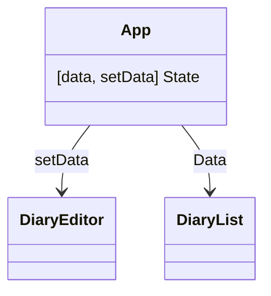

## 한입 크기 리액트 강의
```js
import { useState } from "react";

const DiaryEditor = () => {

	const [state, setState] = useState({
		author: "",
		content: "",
	});

	return (
		<div className="DiaryEditor">
			<h2>오늘의 일기 AUTHOR</h2>
			<div>
				<input
					value={state.author}
					onChange={(e) => {
						setState({
							author: e.target.value,
							content: state.content,
						});
					}}
				/>
			</div>
			<div>
				<textarea
					value={state.content}
					onChange={(e) => {
						setState({
							author: state.author,
							content: e.target.value,
						});
					}}
				/>
			</div>
		</div>
	)
}

export default DiaryEditor;
```
- input과 textarea는 거의 같다. 그래서 state를 객체로 저렇게 묶어줄 수 있다.
- setState를 쓸 때 새로운 객체를 만들어서 author를 바꿀 땐 content는 바뀌면 안되니 저렇게 써준다. 반대로 content 바꿀 때는 author는 안바뀌게

```js
setState({
  ...state,
  author: e.target.value,
});
```
- __spread 문법__ 을 사용할 수도 있다.
- 순서를 바꾸면 동작하지 않음

```js

	const handleChangeState = (e) => {
		setState({
			...state,
			[e.target.name]: e.target.value,
		});
	};

	return (
		<div className="DiaryEditor">
			<h2>오늘의 일기 AUTHOR</h2>
			<div>
				<input
					name="author"
					value={state.author}
					onChange={handleChangeState}
				/>
			</div>
			<div>
				<textarea
					name="content"
					value={state.content}
					onChange={handleChangeState}
				/>
			</div>
		</div>
	)
```
- onChange 이벤트가 중복으로 나열되어 있으니 handleChangeState를 따로 만들어 넣어주기

```js
const DiaryEditor = () => {

	const [state, setState] = useState({
		author: "",
		content: "",
		emotion: 1,
	});

	const handleChangeState = (e) => {
		setState({
			...state,
			[e.target.name]: e.target.value,
		});
	};

	return (
		<div className="DiaryEditor">
			<h2>오늘의 일기 AUTHOR</h2>
			<div>
				<input
					name="author"
					value={state.author}
					onChange={handleChangeState}
				/>
			</div>
			<div>
				<textarea
					name="content"
					value={state.content}
					onChange={handleChangeState}
				/>
			</div>

			<div>
				<select
					name="emotion"
					value={state.emotion}
					onChange={handleChangeState}
				>
					<option value={1}>1</option>
					<option value={2}>2</option>
					<option value={3}>3</option>
					<option value={4}>4</option>
					<option value={5}>5</option>
				</select>
			</div>
		</div>
	)
}
```
select 탭도 똑같이 value, onChange 추가해주기


### dom 요소 선택해서 focus 주기
`useRef`

`	const authorInput = useRef();` 
```js
  <input
    ref={authorInput}
    name="author"
    value={state.author}
    onChange={handleChangeState}
  />
```
- input에 ref로 authorInput을 넣으면 authorInput으로 input에 접근할 수 있게됨

```js
	const handleSubmit = () => {
		if (state.author.length < 1) {
			authorInput.current.focus();
			return;
		}
```
- `authorInput.current.focus()`  
- useRef로 생성한 authorInput은 현재 가리키는 값을 `current` 라는 값으로 불러와서 사용할 수 있다.

## defaultProps
props의 기본값을 설정할 수 있다.
```js
DiaryList.defaultProps = {
	diaryList:[],
}
```

## map 사용
```js
import './App.css';
import DiaryEditor from './DiaryEditor';
import DiaryList from './DiaryList';

const dummyList = [
  {
    id: 1,
    author: "이정환",
    content: "하이1",
    emotion: 1,
    created_date: new Date().getTime()
  },
  {
    id: 2,
    author: "이정",
    content: "하이2",
    emotion: 2,
    created_date: new Date().getTime()
  },
  {
    id: 3,
    author: "이환",
    content: "하이3",
    emotion: 3,
    created_date: new Date().getTime()
  },
]

function App() {
  return (
    <div className="App">
      <DiaryEditor/>
      <DiaryList diaryList={dummyList} />
    </div>
  );
}

export default App;
```

```js
const DiaryList = ({diaryList}) => {

	return (
		<div className="DiaryList">
			<h2>일기 리스트</h2>
			<h4>{diaryList.length}개의 일기가 있스빈다.</h4>
			<div>
				{diaryList.map((it) => (
					<div>
						<div>작성자 : {it.author}</div>
						<div>일기 : {it.content}</div>
						<div>감정 : {it.emotion}</div>
						<div>작성 시간 : {it.created_date}</div>
					</div>
				))}
			</div>
		</div>
	);
};

DiaryList.defaultProps = {
	diaryList:[],
}

export default DiaryList;
```

### key
map 배열의 인덱스를 key로 사용할 수 있지만 삭제 등의 이유로 순서가 바껴버리면 문제가 생길 수 있다.

### diary list 만들기
```js
  <div>
    {diaryList.map((it) => (
      <DiaryItem key={it.id} {...it} />
    ))}
  </div>
```
diarylist를 수정, 삭제 기능도 넣어야하기 때문에 DiaryItem를 따로 만들고 위위 코드의 map부분을 저렇게 바꿔주기
prop으로 {...it} it을 다 넘겨준다.

```js
const DiaryItem = ({author, content, created_date, emotion, id}) => {
	return (
		<div className="DiaryItem">
		<div className="info">
			<span>
				작성자 : {author} | 감정점수 : {emotion}
			</span>
			<br />
			<span className="date">
				{new Date(created_date).toLocaleString()}
			</span>
		</div>
		<div className="content">{content}</div>

		</div>
	)
}

export default DiaryItem;
```

## 컴포넌트 트리


- 부모와 자식들이 얽힌 계층구조
- 같은 레벨간에는 정보를 주고받기가 불가능하다. 
- React는 단방향으로만 데이터가 흐른다.

- DiaryEditor, DiaryList의 공통부모인 App 컴포넌트가 일기 데이터를 state로 가지고 있고 각각 리스트에는 Data를 editor에는 setData를 props로 전달해주면 된다.

- 리액트에서 추가, 수정, 삭제같은 __EVENT__ 는 아래에서 위로 올라가는 구조일 수 있다. -> DiaryEditor에서 "추가"라는 이벤트가 발생하게 되면 setData를 변화시키면서 data가 변경된다.

```js
function App() {
  const [data, setDate] = useState([]);

  const dataId = useRef(0);

  const onCreate = (author, content, emotion) => {
    const create_date = new Date().getTime();
    const newItem = {
      author,
      content,
      emotion,
      create_date,
      id : dataId.current,
    }
    dataId.current += 1;
    setDate([newItem, ...data]);
  }

  return (
    <div className="App">
      <DiaryEditor onCreate={onCreate} />
      <DiaryList diaryList={data} />
    </div>
  );
}

```
dummylist를 지우고 App에 data를 관리하는 useState를 만들어준다.
DiaryList에는 data만 전달하고 DiaryEditor에는 data를 추가할 수 있는 함수 onCreate를 props로 넘겨준다.
onCreate는 author, content, emotion을 인자로 받고 setDate를 통해서 새로운 diary를 newItem으로 추가해준다.

```js
const DiaryEditor = ({onCreate}) => {
	const authorInput = useRef();
	const contentInput = useRef();

	const [state, setState] = useState({
		author: "",
		content: "",
		emotion: 1,
	});

	const handleChangeState = (e) => {
		setState({
			...state,
			[e.target.name]: e.target.value,
		});
	};

	const handleSubmit = () => {
		if (state.author.length < 1) {
			authorInput.current.focus();
			return;
		}

		if (state.content.length < 5) {
			contentInput.current.focus();
			return;
		}

		onCreate(state.author, state.content, state.emotion);
		alert("저장 성공");
		setState({
			author: "",
			content: "",
			emotion: 1,
		})
	}

```
props로 {onCreate}을 넣고 `onCreate`를 이용해 추가하고 난 이후에 setState를 이용해 일기쓰는 곳을 초기화 시켜준다.

## 삭제하기
data state를 업데이트 시켜줘야함
```js
  const onDelete = (targetId) => {
    console.log(`$targetId}가 삭제되었습니다.`)
  }

  return (
    <div className="App">
      <DiaryEditor onCreate={onCreate} />
      <DiaryList onDelete={onDelete} diaryList={data}/>
    </div>
  );
}
```
App에서 onDelete를 만들고 DiaryItem의 부모인 DiaryList의 prop으로 ondelete를 전달시켜줘야한다.
```js
const DiaryItem = ({onDelete, author, content, created_date, emotion, id}) => {
	return (
		<div className="DiaryItem">
		<div className="info">
			<span>
				작성자 : {author} | 감정점수 : {emotion}
			</span>
			<br />
			<span className="date">
				{new Date(created_date).toLocaleString()}
			</span>
		</div>
		<div className="content">{content}</div>
		<button
			onClick={() => {
				console.log(id);
				if (window.confirm(`${id}번째 일기를 정말 삭제하?`)) {
					onDelete(id);
				}
			}}
		>
		삭제하기</button>
		</div>
	)
}
```
`window.confirm` 은 확인하는 alert창

```js
  const onDelete = (targetId) => {
    console.log(`${targetId}가 삭제되었습니다.`);
    const newDiaryList = data.filter((it) => it.id !== targetId);
    setData(newDiaryList);
  }
```
- App 에서 filter를 이용해서 it.id가 targetId가 아닌 것들로 필터링된 newDiaryList를 만들어주고 그걸 setData에 전달해주면 된다.

## 수정하기
```js
import { useState } from "react";

const DiaryItem = ({
	onRemove,
	author,
	content,
	created_date,
	emotion,
	id
}) => {
	const [isEdit, setIsEdit] = useState(false);
	const toggleIsEdit = () => setIsEdit(!isEdit);

	const handleRemove = () => {
		if (window.confirm(`${id}번째 일기를 정말 삭제하?`)) {
			onRemove(id);
		}
	}

	return (
		<div className="DiaryItem">
		<div className="info">
			<span>
				작성자 : {author} | 감정점수 : {emotion}
			</span>
			<br />
			<span className="date">
				{new Date(created_date).toLocaleString()}
			</span>
		</div>
		<div className="content">{content}</div>
			<button onClick={handleRemove}>삭제하기</button>
			<button onClick={toggleIsEdit}>수정하기</button>
		</div>
	)
}
```
- useState와 toggleIsEdit 만들기
- isEdit이 true면 수정할 수 있게 만들기

```js
		<div className="content">
			{isEdit ? (
				<>
					<textarea />
				</>
			) : (
				<>{content}</>
			)}
		</div>
```
삼항연산자 사용하기
```js
		<div className="content">
			{isEdit ? (
				<>
					<textarea 
						value={localContent}
						onChange={(e) => setLocalContent(e.target.value)}
					/>
				</>
			) : (
				<>{content}</>
			)}
		</div>
			{isEdit ? (<>
				<button onClick={toggleIsEdit}>수정취소</button>
				<button>수정완료</button>
			</>) : (<>
				<button onClick={handleRemove}>삭제하기</button>
				<button onClick={toggleIsEdit}>수정하기</button>
			</>)}

		</div>
```
수정중일 때 버튼 바뀌게

```js
  const onEdit = (targetId, newContent) => {
    setData(
      data.map((it) => it.id === targetId ? {...it, content:newContent} : it)
    )
  }
```
- App에서 수정할 수 있는 기능을 담은 onEdit 만들기
- map을 이용해서 수정된 게 있으면 content를 업데이트 해주는 방식으로

```js
import { useState, useRef } from "react";

const DiaryItem = ({
  onRemove,
  onEdit,
  author,
  content,
  created_date,
  emotion,
  id,
}) => {
  const [isEdit, setIsEdit] = useState(false);
  const toggleIsEdit = () => setIsEdit(!isEdit);

  const [localContent, setLocalContent] = useState(content);
  const localContentInput = useRef();

  const handleRemove = () => {
    if (window.confirm(`${id}번째 일기를 정말 삭제하?`)) {
      onRemove(id);
    }
  };

  const handleQuitEdit = () => {
    setIsEdit(false);
    setLocalContent(content); //수정 취소 버튼 눌렀을 때 수정 textarea 원본 값 가지게
  };

  const handleEdit = () => {
		console.log(id)
    if (localContent.length < 5) {
      localContentInput.current.focus();
      return;
    }

    if (window.confirm(`${id}번 째 일기를 수정?`)) {
      onEdit(id, localContent);
      toggleIsEdit();
    }
  };

  return (
    <div className="DiaryItem">
      <div className="info">
        <span>
          작성자 : {author} | 감정점수 : {emotion}
        </span>
        <br />
        <span className="date">{new Date(created_date).toLocaleString()}</span>
      </div>
      <div className="content">
        {isEdit ? (
          <>
            <textarea
              ref={localContentInput}
              value={localContent}
              onChange={(e) => setLocalContent(e.target.value)}
            />
          </>
        ) : (
          <>{content}</>
        )}
      </div>
      {isEdit ? (
        <>
          <button onClick={handleQuitEdit}>수정취소</button>
          <button onClick={handleEdit}>수정완료</button>
        </>
      ) : (
        <>
          <button onClick={handleRemove}>삭제하기</button>
          <button onClick={toggleIsEdit}>수정하기</button>
        </>
      )}
    </div>
  );
};

```